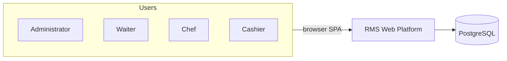
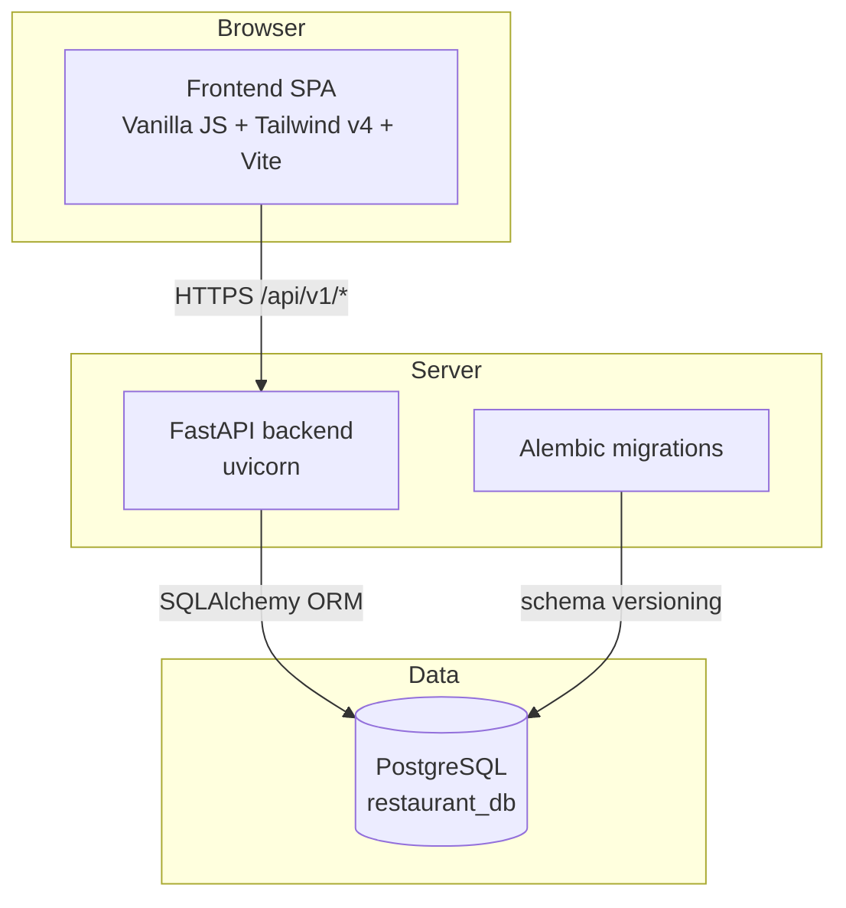
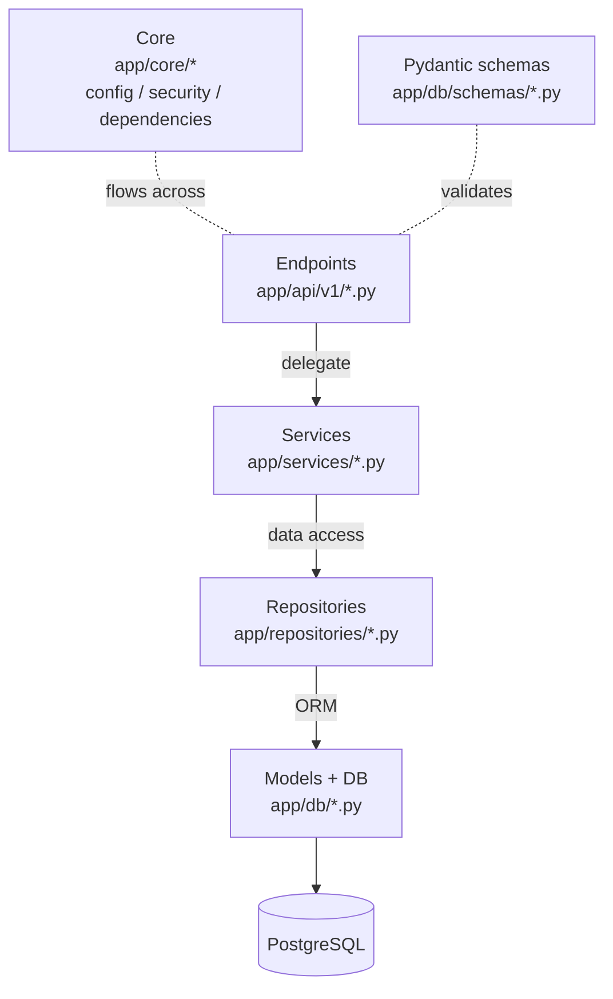
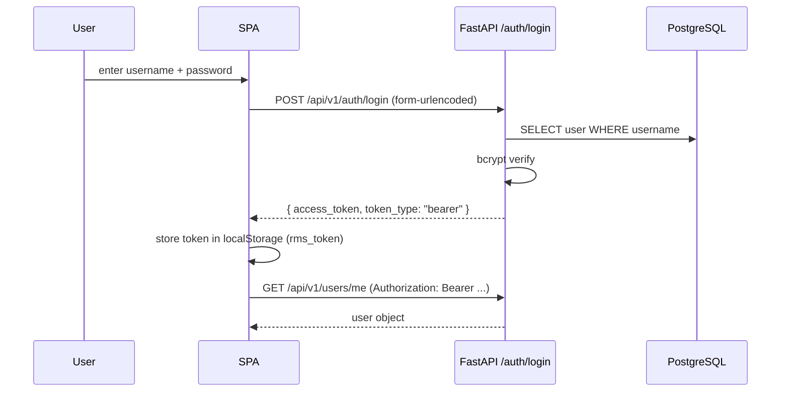

# Architecture — Restaurant Management System

This document describes the high-level architecture of the platform: how the pieces fit together, the layers the backend is split into, and how the system is deployed.

Back to [docs/README.md](README.md).

## 1. System context (C4 level 1)



- The platform is operated by four staff roles: **admin**, **waiter**, **chef** and **cashier**. Customers are not authenticated users during the MVP — see [vision.md](vision.md).
- All users interact with the same Single Page Application rendered in the browser.

## 2. Container diagram (C4 level 2)



- `frontend/` is a static SPA built with Vite; talks to the backend over JSON HTTP with JWT Bearer auth.
- `backend/` is a FastAPI app exposing `/api/v1/*` endpoints plus `/` and `/health` at root.
- Schema is owned by SQLAlchemy models and evolved through Alembic migrations under `backend/alembic/versions/`.

## 3. Backend layers

The backend is organised in **four decoupled layers**. A request flows top-down only; lower layers never call higher layers.



| Layer | Path | Responsibility |
|---|---|---|
| Endpoints (presentation) | `app/api/v1/` | Receive HTTP, validate via Pydantic, return JSON. No business logic. |
| Services (business logic) | `app/services/` | Enforce rules (uniqueness, state transitions, totals, stock). |
| Repositories (data access) | `app/repositories/` | Single place that issues SQLAlchemy queries. |
| Models + DB (persistence) | `app/db/models/`, `app/db/database.py` | SQLAlchemy ORM, session factory, Base. |
| Schemas | `app/db/schemas/` | Pydantic v2 input/output DTOs. |
| Core | `app/core/` | Settings, JWT helpers, FastAPI dependencies (`get_db`, `get_current_user`). |

## 4. Module map (14 routers)

| Module | Router file | Service | Repository | Model(s) |
|---|---|---|---|---|
| Auth | `auth.py` | `auth_service` | `user_repository` | `User` |
| Users | `users.py` | `user_service` | `user_repository` | `User` |
| Categories | `categories.py` | `category_service` | `category_repository` | `Category` |
| Locations | `locations.py` | `location_service` | `location_repository` | `Location` |
| Tables | `tables.py` | `table_service` | `table_repository` | `Table`, `Location` |
| Reservations | `reservations.py` | `reservation_service` | `reservation_repository` | `Reservation`, `Table` |
| Menu | `menu.py` | `menu_item_service` | `menu_item_repository` | `MenuItem`, `Category` |
| Orders | `orders.py` | `order_service` | `order_repository` | `Order`, `OrderItem`, `MenuItem`, `Table`, `User` |
| Kitchen | `kitchen.py` | `kitchen_service` | `kitchen_repository` | `KitchenOrder`, `Order` |
| Inventory | `inventory.py` | `inventory_service` | `inventory_repository` | `InventoryItem`, `InventoryMovement` |
| Payments | `payments.py` | `payment_service` | `payment_repository` | `Payment`, `Order` |
| Reports | `reports.py` | `report_service` | `report_repository` | reuses `Order`, `OrderItem`, `Payment` |
| Settings | `settings.py` | `setting_service` | `setting_repository` | `Setting` |

Additional models that exist in the database and have services/repositories but **no router yet**:

- `Supplier`, `Purchase`, `PurchaseDetail`, `Recipe`, `Customer` — see [backend/database-guide.md](backend/database-guide.md).

## 5. Request flow example

```text
POST /api/v1/orders/                    (1) endpoint hits `orders.py`
        │
        ▼
OrderCreate schema validated           (2) Pydantic
        │
        ▼
OrderService.create(table_id, waiter)  (3) business logic
        │  - checks table exists / available
        │  - computes status = pending
        ▼
OrderRepository.create(order)          (4) SQLAlchemy INSERT
        │
        ▼
OrderOut schema returned as JSON       (5) Pydantic
        │
        ▼
HTTP 201 + body → SPA
```

## 6. Authentication



See [backend/user-credentials.md](backend/user-credentials.md) for how the first admin is created.

## 7. Deployment topology

### Local development

```text
docker-compose up -d           # PostgreSQL on :5432
cd backend && uvicorn app.main:app --reload    # :8000
cd frontend && pnpm dev        # :5173 (Vite, VITE_API_URL → http://localhost:8000)
```

### Production

Configured via `render.yaml` (backend) and `vercel.json` (frontend):

- Backend: Docker web service running `uvicorn`, Python 3.13, deployed on **Render**.
- Frontend: Vite-built static site, deployed on **Vercel** with SPA fallback for hash routing (`vercel.json` rewrites).
- Database: managed PostgreSQL on Render.

Deploys are triggered by the **release** workflow in `.github/workflows/release.yml`:

- On a PR targeting `main`: a validation gate runs (backend lint + tests, frontend lint + prettier + build). No deploy. The PR can only merge once this gate is green.
- On push to `main` (a merged release PR): a semver tag is computed from the previous tag and pushed, a GitHub Release is published (notes generated from `.github/release.yml`), the backend deploys to **Render** via API hook, and the frontend deploys to **Vercel** via CLI (or auto-deploy if Vercel is linked to the repo).

See [contributing.md](contributing.md) for the release flow and the secrets/branch protection rules.

## 8. Cross-cutting concerns

| Concern | Where | Notes |
|---|---|---|
| CORS | `app/main.py` | `allow_origins=["*"]` — restrict in production. |
| Settings | `app/core/config.py` | Pydantic Settings, reads `.env`. `SECRET_KEY` is required. |
| JWT | `app/core/security.py` | HS256, 30-minute access tokens. |
| Migrations | `backend/alembic/versions/` | Six migrations to date (001_initial → 006_fix_reservation_fk). |
| Logging | `app/main.py` + services | Console logging; no aggregator configured yet. |
| Testing | `backend/tests/` | pytest; smoke tests + model tests. |
| Error shape | Services raise `HTTPException` with `detail` strings. | Frontend reads `response.detail` in `api.js`. |
