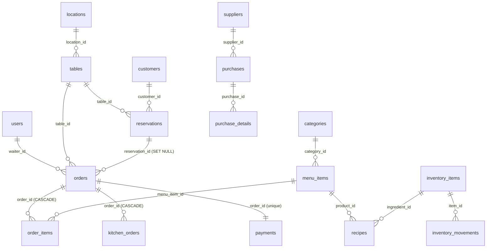

# Database Guide

Back to [docs/README.md](README.md).

## 1. Overview

The data layer of the Restaurant Management System is a relational schema on PostgreSQL, managed by SQLAlchemy declarative models in `backend/app/db/models/`. Migrations are versioned with Alembic in `backend/alembic/versions/`. The schema covers authentication, restaurant operations (tables, reservations, menu, orders, kitchen), financials (payments, purchases) and operational lookups (locations, categories, suppliers, inventory).

## 2. Stack

- PostgreSQL 16 (Docker image `postgres:16-alpine` via `docker-compose.yml`).
- SQLAlchemy 2.0 ORM (declarative base in `app/db/database.py`).
- Alembic 1.18 for migrations.
- All primary keys use UUID (Python `uuid.uuid4` default), except `reservations.id` and `customers.id` which are `String(30)` to keep compatibility with legacy client-side IDs.

## 3. Entities

### Authentication & users

#### `users` — `User`
Staff accounts. All authenticated traffic comes from this table.

| Column | Type | Notes |
|---|---|---|
| `id` | UUID PK | |
| `username` | String(50) unique not null | |
| `email` | String(255) unique not null | |
| `hashed_password` | String(255) not null | bcrypt hash |
| `full_name` | String(100) not null | |
| `role` | Enum `admin`, `waiter`, `chef`, `cashier` not null, default `waiter` | enum `userrole` |
| `is_active` | Boolean default true | |
| `created_at`, `updated_at` | DateTime(tz) | |

Relationship: `orders` → `Order` (back_populates `waiter`).

> There is **no `client` role** in the backend. Customers do not authenticate during the MVP. See [vision.md](vision.md).

#### `customers` — `Customer`
Lightweight customer record used only for reservation history. Customers never log in.

| Column | Type | Notes |
|---|---|---|
| `id` | String(30) PK | legacy client-side ID |
| `name` | String(100) not null | |
| `phone`, `email` | nullable | |
| `created_at` | DateTime(tz) | |

### Restaurant layout

#### `locations` — `Location`
Physical dining areas (Terraza, Interior, VIP, Barra, etc.).

| Column | Type | Notes |
|---|---|---|
| `id` | UUID PK | |
| `name` | String(100) unique not null | |
| `created_at`, `updated_at` | DateTime(tz) | |

#### `tables` — `Table`
A table belongs to at most one location (`location_id` nullable, `ON DELETE SET NULL`).

| Column | Type | Notes |
|---|---|---|
| `id` | UUID PK | |
| `number` | Integer unique not null | displayed table number |
| `capacity` | Integer not null | |
| `status` | Enum `available`, `occupied`, `reserved`, `maintenance`, default `available` | enum `tablestatus` |
| `location_id` | UUID FK → `locations.id`, `ON DELETE SET NULL`, nullable, indexed | |
| `created_at`, `updated_at` | DateTime(tz) | |

### Menu

#### `categories` — `Category`
Dish grouping (Platos fuertes, Entradas, Bebidas, …).

| Column | Type |
|---|---|
| `id` | UUID PK |
| `name` | String(100) unique not null |
| `description` | String(255) nullable |
| `is_active` | Boolean default true |
| `created_at`, `updated_at` | DateTime(tz) |

#### `menu_items` — `MenuItem`
Items that can be sold.

| Column | Type | Notes |
|---|---|---|
| `id` | UUID PK | |
| `name` | String(150) not null | |
| `description` | Text nullable | |
| `price` | Numeric(10,2) not null | |
| `category_id` | UUID FK → `categories.id`, not null | |
| `is_available` | Boolean default true | |
| `image_url` | String(500) nullable | |
| `created_at`, `updated_at` | DateTime(tz) | |

### Reservations & orders

#### `reservations` — `Reservation`
Bookings made by a guest (customer or walk-in). The `id` is a String(30) — the frontend generated it when reservations were mock-only, and the column was kept that way.

| Column | Type | Notes |
|---|---|---|
| `id` | String(30) PK | |
| `customer_id` | String(30) FK → `customers.id`, nullable | optional link to a known customer |
| `table_id` | UUID FK → `tables.id`, nullable | |
| `guest_name`, `guest_phone` | String nullable | walk-in identity |
| `reservation_date` | DateTime(tz) not null | |
| `guest_count` | Integer not null | |
| `status` | Enum `pending`, `confirmed`, `cancelled`, `completed`, default `pending` | enum `reservationstatus` |
| `notes` | Text nullable | |
| `created_at`, `updated_at` | DateTime(tz) | |

#### `orders` — `Order`
An order belongs to one waiter and one table. May be linked to a reservation.

| Column | Type | Notes |
|---|---|---|
| `id` | UUID PK | |
| `waiter_id` | UUID FK → `users.id`, not null | |
| `table_id` | UUID FK → `tables.id`, not null | |
| `reservation_id` | String(30) FK → `reservations.id`, `ON DELETE SET NULL`, nullable | |
| `status` | Enum `pending`, `in_progress`, `completed`, `cancelled`, default `pending` | enum `orderstatus` |
| `total` | Numeric(10,2) default 0 | |
| `created_at`, `updated_at` | DateTime(tz) | |

Relationships: `waiter` (User), `items` (OrderItem).

#### `order_items` — `OrderItem`
Lines of an order. Cascade-deleted with the order.

| Column | Type | Notes |
|---|---|---|
| `id` | UUID PK | |
| `order_id` | UUID FK → `orders.id`, `ON DELETE CASCADE`, not null | |
| `menu_item_id` | UUID FK → `menu_items.id`, not null | |
| `quantity` | Integer default 1 | |
| `unit_price` | Numeric(10,2) not null | snapshot of menu price at order time |
| `subtotal` | Numeric(10,2) not null | `quantity * unit_price` |

### Kitchen

#### `kitchen_orders` — `KitchenOrder`
One per order item that needs to be cooked. Updated by kitchen staff through `/api/v1/kitchen`.

| Column | Type | Notes |
|---|---|---|
| `id` | UUID PK | |
| `order_id` | UUID FK → `orders.id`, `ON DELETE CASCADE`, not null | |
| `menu_item_name` | String(150) not null | snapshot of the dish name for the kitchen display |
| `quantity` | Integer not null | |
| `notes` | Text nullable | waiter → kitchen comms |
| `status` | Enum `pending`, `preparing`, `ready`, `delivered`, default `pending` | enum `kitchenorderstatus` |
| `priority` | Integer default 0 | higher = sooner |
| `created_at`, `updated_at` | DateTime(tz) | |

### Payments

#### `payments` — `Payment`
One-to-one with `orders` (`order_id` is **unique**).

| Column | Type | Notes |
|---|---|---|
| `id` | UUID PK | |
| `order_id` | UUID FK → `orders.id`, unique, not null | |
| `amount` | Numeric(10,2) not null | |
| `method` | Enum `cash`, `card`, `transfer`, not null | enum `paymentmethod` |
| `status` | Enum `pending`, `completed`, `refunded`, `failed`, default `pending` | enum `paymentstatus` |
| `created_at`, `updated_at` | DateTime(tz) | |

### Inventory

#### `inventory_items` — `InventoryItem`
Insumos / ingredients.

| Column | Type | Notes |
|---|---|---|
| `id` | UUID PK | |
| `name` | String(150) not null | |
| `unit` | String(50) not null | e.g. `kg`, `L`, `unit` |
| `quantity` | Numeric(10,2) default 0 | current stock |
| `min_stock` | Numeric(10,2) default 0 | threshold for `/low-stock` |
| `is_active` | Boolean default true | |
| `created_at`, `updated_at` | DateTime(tz) | |

#### `inventory_movements` — `InventoryMovement`
Append-only ledger of stock changes.

| Column | Type | Notes |
|---|---|---|
| `id` | UUID PK | |
| `item_id` | UUID FK → `inventory_items.id`, not null | |
| `type` | Enum `in`, `out`, not null | enum `movementtype` |
| `quantity` | Numeric(10,2) not null | positive number |
| `reason` | Text nullable | |
| `created_at` | DateTime(tz) | |

### Purchasing (models only — no router yet)

#### `suppliers` — `Supplier`
| Column | Type |
|---|---|
| `id` | UUID PK |
| `name` | String(150) not null |
| `phone`, `email`, `address` | nullable |
| `is_active` | Boolean default true |
| `created_at` | DateTime(tz) |

#### `purchases` — `Purchase`
| Column | Type | Notes |
|---|---|---|
| `id` | UUID PK | |
| `supplier_id` | UUID FK → `suppliers.id`, not null | |
| `purchase_date` | DateTime(tz) default now() | |
| `status` | String(30) not null, default `pending` | |
| `total` | Numeric(10,2) default 0 | |
| `notes` | Text nullable | |
| `created_at` | DateTime(tz) | |

#### `purchase_details` — `PurchaseDetail`
Line items of a purchase order. Defined in `app/db/models/purchase_detail.py` (referenced by `__init__.py`).

#### `recipes` — `Recipe`
Maps a `menu_item` to the `inventory_item`s required to prepare it.

| Column | Type |
|---|---|
| `id` | UUID PK |
| `product_id` | UUID FK → `menu_items.id`, not null |
| `ingredient_id` | UUID FK → `inventory_items.id`, not null |
| `required_quantity` | Numeric(10,2) not null |

### System

#### `settings` — `Setting`
A single row holding restaurant-level configuration (tax rate, currency, contact info).

| Column | Type | Notes |
|---|---|---|
| `id` | String(50) PK, default `uuid4` | |
| `restaurant_name` | String(200) default "El Fogon Caribeno" | |
| `address` | Text default "" | |
| `phone` | String(50) default "" | |
| `email` | String(200) default "" | |
| `tax_rate` | Float default 11.5 | |
| `currency` | String(10) default "USD" | |
| `created_at`, `updated_at` | DateTime(tz) | |

## 4. Relationships summary



## 5. Migrations

Schema is migrated with Alembic. Migrations live in `backend/alembic/versions/`. Current chain:

| Revision | File | Description |
|---|---|---|
| 001 | `001_initial.py` | Initial schema — most tables. |
| 002 | `002_normalize_location.py` | Adds the `locations` table and replaces the `location` string on `tables` with `location_id` FK. |
| 003 | `003_add_settings.py` | Adds the `settings` table. |
| 004 | `004_add_guest_fields_reservations.py` | Adds `guest_name` and `guest_phone` to `reservations`. |
| 005 | `005_add_reservation_id_to_orders.py` | Adds `reservation_id` FK to `orders`. |
| 006 | `006_fix_reservation_fk_on_delete.py` | Changes `orders.reservation_id` FK to `ON DELETE SET NULL`. |

Apply with:

```bash
cd backend
alembic upgrade head
```

## 6. Initial data

`backend/app/db/seed.py` can seed reference data (locations, categories, a few menu items, a default admin). Run it directly:

```bash
python -m app.db.seed
```

There is also `database/init/01_schema.sql` and `database/seed/` for environments that bootstrap from raw SQL (the Docker entrypoint loads these on first start).

## 7. Design principles

- **Models are the source of truth.** The Alembic migration chain is generated from the models; never hand-write SQL that diverges.
- **UUIDs** for primary keys except where legacy `String(30)` IDs are still in use (`reservations`, `customers`, `settings`).
- **Soft deletes** are preferred for active-flag columns (`is_active`) over hard deletes.
- **Cascade rules** keep child rows tidy: `order_items` and `kitchen_orders` cascade with their `orders`. `tables.location_id` uses `SET NULL`. Orders pointing to reservations use `SET NULL`.
- **Audit columns**: most tables have `created_at`; updatable tables also have `updated_at` with `onupdate`.
